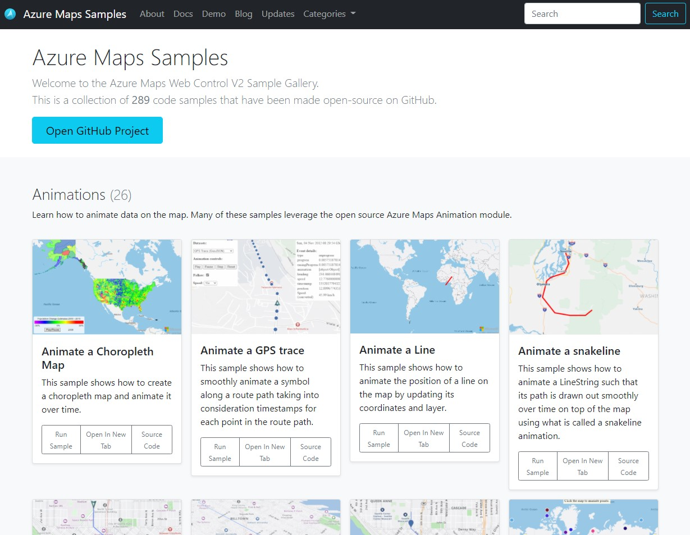

# Azure Maps Code Samples

A collection of over a hundred code samples for the [Azure Maps](https://azuremaps.com/) Web SDK.

[Try it now](https://samples.azuremaps.com/)

## Related Projects

* [Azure Maps Web SDK Open modules](https://github.com/microsoft/Maps/blob/master/AzureMaps.md#open-web-sdk-modules) - A collection of open source modules that extend the Azure Maps Web SDK.
* [Azure Maps & Azure Active Directory Samples](https://github.com/Azure-Samples/Azure-Maps-AzureAD-Samples)
* [List of open-source Azure Maps projects](https://github.com/microsoft/Maps/blob/master/AzureMaps.md)

## Additional Resources

* [Azure Maps (main site)](https://azuremaps.com/)
* [Azure Maps Documentation](https://docs.azuremaps.com/)
* [Azure Maps Samples](https://samples.azuremaps.com/)
* [Azure Maps Demo](https://demo.azuremaps.com/)
* [Azure Maps Blog](https://blog.azuremaps.com/)
* [Azure Maps Updates](https://updates.azuremaps.com/)
* [Azure Maps Data feedback](https://feedback.azuremaps.com/)

## Contributing

We welcome contributions. Feel free to submit code samples, file issues and pull requests on the repo and we'll address them as we can. 
Learn more about how you can help on our [Contribution Rules & Guidelines](CONTRIBUTING.md). 

You can reach out to us anytime with questions and suggestions using our communities below:
* [Microsoft Q&A](https://docs.microsoft.com/en-us/answers/topics/azure-maps.html)
* [Azure Maps feedback](https://feedback.azure.com/forums/909172-azure-maps)

This project has adopted the [Microsoft Open Source Code of Conduct](https://opensource.microsoft.com/codeofconduct/). 
For more information, see the [Code of Conduct FAQ](https://opensource.microsoft.com/codeofconduct/faq/) or 
contact [opencode@microsoft.com](mailto:opencode@microsoft.com) with any additional questions or comments.

## License

MIT
 
See [License](LICENSE.md) for full license text.
