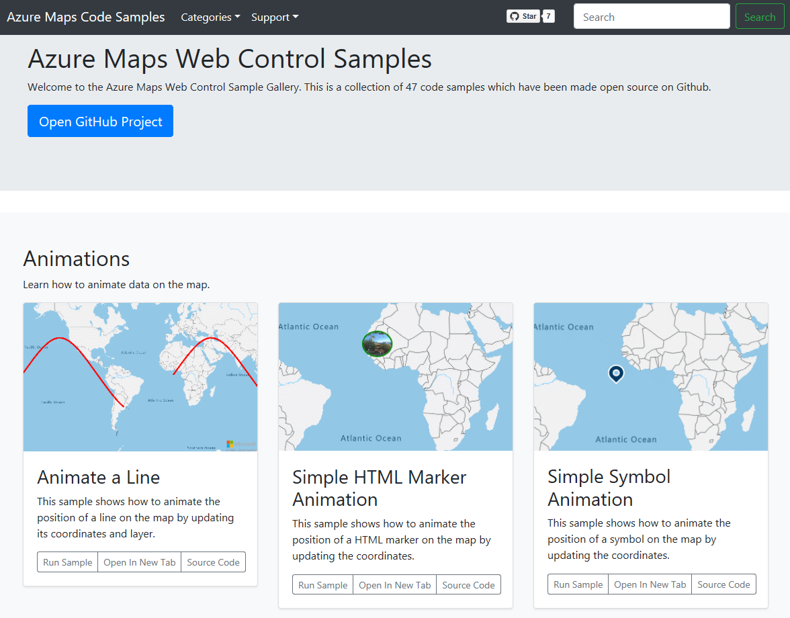

# Azure Maps Code Samples

A collection of over a hundred code samples for the [Azure Maps](https://azure.com/maps) Web SDK.

[Try it now](https://azuremapscodesamples.azurewebsites.net/)

## Related Projects

* [Azure Maps & Azure Active Directory Samples](https://github.com/Azure-Samples/Azure-Maps-AzureAD-Samples)
* [AirMap Azure Maps plugin](https://github.com/airmap/js-azure-maps-plugin)
* [Azure Maps PowerApps PCF component](https://github.com/jenschristianschroder/pcfAzureMaps)
* [Azure Maps PowerApps PCF Search component](https://github.com/mkcgphy/Azure-Maps-Get-Search-Address-TypeAhead)
* [Real-time flight map with Azure functions, CosmosDB and SignalR](https://github.com/davetheunissen/Global-Azure-Bootcamp-2019-Workshop)
* [Azure Maps Jupyter Notebook samples](https://github.com/Azure-Samples/Azure-Maps-Jupyter-Notebook)
* [Azure Maps for Retail, Jupyter Notebooks](https://github.com/5h15h/Azure-Maps-Jupyter-Notebooks)

## Additional Resources

* [Azure Maps (main site)](https://azure.com/maps)
* [Azure Maps Documentation](https://docs.microsoft.com/azure/azure-maps/index)
* [Azure Maps Blog](https://azure.microsoft.com/blog/topics/azure-maps/)
* [MSDN Forums](https://social.msdn.microsoft.com/Forums/en-US/home?forum=azurelbs)
* [StackOverflow [azure-maps]](https://stackoverflow.com/questions/tagged/azure-maps)
* [Azure Maps feedback](https://feedback.azure.com/forums/909172-azure-maps)

## Contributing

We welcome contributions. Feel free to submit code samples, file issues and pull requests on the repo and we'll address them as we can. 
Learn more about how you can help on our [Contribution Rules & Guidelines](CONTRIBUTING.md). 

You can reach out to us anytime with questions and suggestions using our communities below:
* [MSDN Forums](https://social.msdn.microsoft.com/Forums/en-US/home?forum=azurelbs)
* [StackOverflow [azure-maps]](https://stackoverflow.com/questions/tagged/azure-maps)
* [Azure Maps feedback](https://feedback.azure.com/forums/909172-azure-maps)

This project has adopted the [Microsoft Open Source Code of Conduct](https://opensource.microsoft.com/codeofconduct/). 
For more information, see the [Code of Conduct FAQ](https://opensource.microsoft.com/codeofconduct/faq/) or 
contact [opencode@microsoft.com](mailto:opencode@microsoft.com) with any additional questions or comments.

## License

MIT
 
See [License](LICENSE.md) for full license text.
